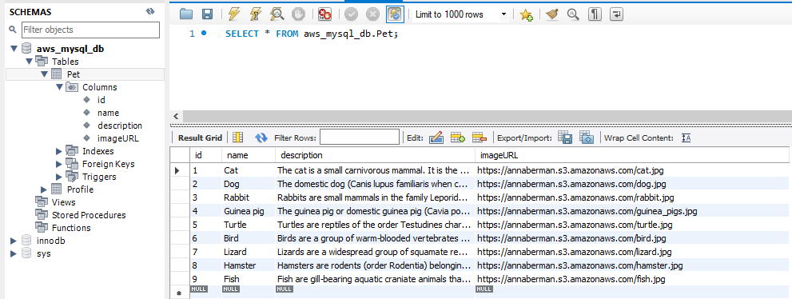
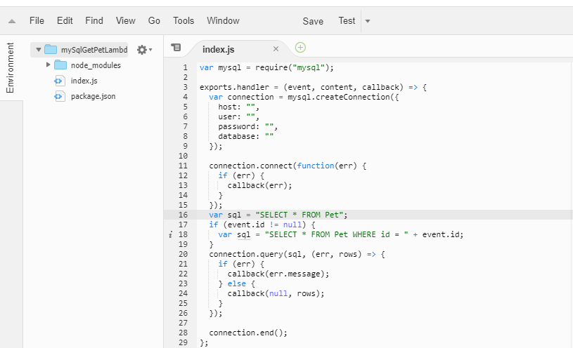
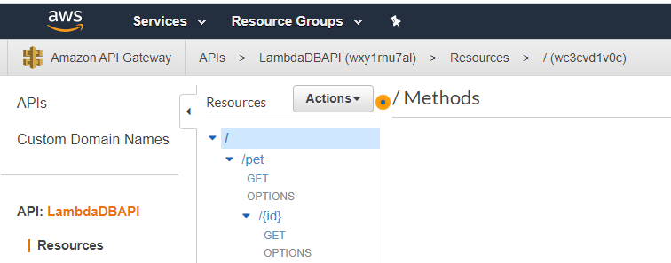
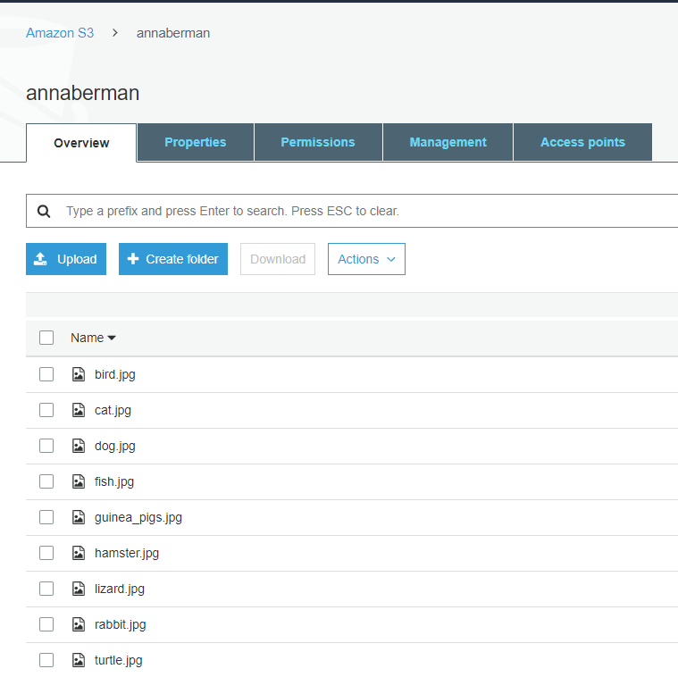

This project was bootstrapped with [Create React App](https://github.com/facebook/create-react-app).

## Pets gallery with AWS cognito authentication
Pets and Pet pages are visible only for logined users

Technologies used in this application:

## 1) AWS cognito Authentication
Implemented register, login (including email verification), logout, change password and forgot password with AWS cognito. 

## 3) AWS RDS
Created AWS database with table Pet with next columns: id (primary key), name, description and imageURL.

## 4) AWS Lambda function
Created Lambda function. This function receive an optional parameter pet id and select from the AWS RDS all pets ar specific pet by id.

## 5) AWS API gateway
Created pet resource with GET and GET by id methods. These methods call AWS Lambda function and return data to the client.

## 6) AWS S3 bucket
Created AWS S3 bucket to store images of pets. Image url stored in imageURL column in Pet table.

## 7) Bootstrap and Bulma
Designed using bootstrap and bulma packages.

